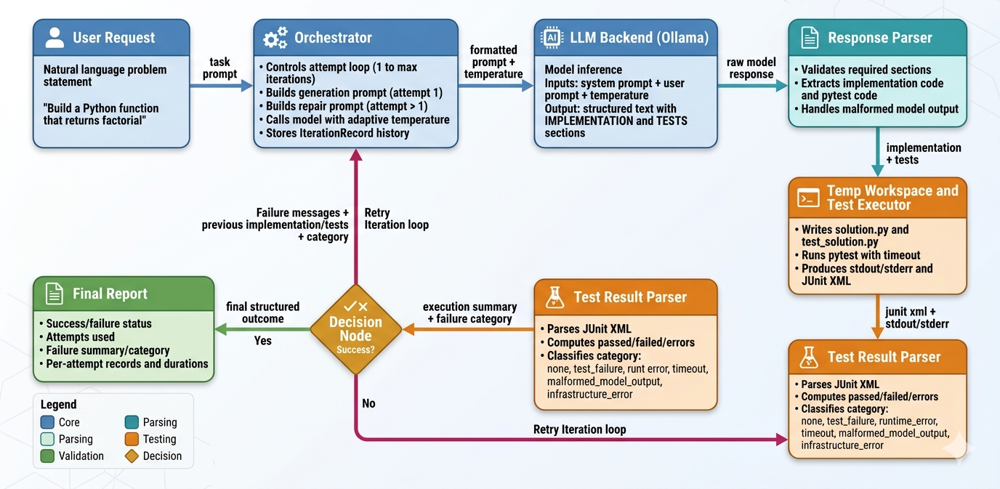

# Codebase Create

An intelligent Python code generation and refinement system powered by LLMs. This agent takes a natural language request, generates implementation and test code, executes tests, and iteratively refines the solution based on failures—all without human intervention.

## Overview

The system addresses the challenge of bridging the gap between natural language specifications and executable, tested Python code. By combining LLM generation with automated test execution and adaptive refinement, it achieves higher quality solutions than single-shot generation alone.

### Key Features

- **Iterative Refinement**: Up to N attempts to fix failing code, with each iteration learning from previous test failures
- **Adaptive Temperature Strategy**: Dynamically adjusts LLM sampling temperature to balance precision and exploration across attempts
- **Automated Testing**: Runs pytest with structured XML output parsing for clear failure diagnosis
- **Robust Parsing**: Handles malformed model outputs gracefully with fallback mechanisms
- **Configurable Backends**: Built on Ollama for flexible model swapping
- **Detailed Reporting**: Full execution trace including artifacts, timings, and failure categories

## Architecture



### Core Components

| File | Purpose |
|------|---------|
| `orchestrator.py` | Main loop: prompt → generate → test → iterate |
| `llmbackends.py` | LLM client (Ollama) integration |
| `prompts.py` | System prompt and generation/repair prompt templates |
| `response_parser.py` | Extracts `## IMPLEMENTATION` and `## TESTS` sections |
| `executor.py` | Temp workspace, pytest runner, output capture |
| `test_results.py` | JUnit XML parsing, failure categorization |
| `config.py` | Configuration: model, timeouts, iterations, temperature |
| `models.py` | Data structures: `IterationRecord`, `FinalReport`, `TestExecutionResult` |
| `app.py` | Entry point, result printing |

## How It Works

### Iteration Strategy

1. **Attempt 1**: Full generation from natural language
2. **Attempts 2+**: Repair prompt with previous code, test code, and failure messages
3. **Convergence**: Success halts loop early; all N attempts exhaust on stubborn failures

### Temperature Scheduling

Temperature controls randomness in LLM sampling:

- **Low (0.08)**: Precise, deterministic—best for initial generation and syntax recovery
- **High (0.50)**: Exploratory, diverse—helps escape repeated failures

The agent uses an **adaptive schedule**:

```
Base Temperature = 0.1 + 0.06 × (attempt - 1)

Category Adjustments:
  - malformed_model_output or syntax_error  → subtract 0.08
  - test_failure or runtime_error           → add 0.05
  - timeout                                 → add 0.03

Repetition Escape:
  - If same failure type repeats 2× → add 0.10

Final: clamp(temp, min=0.08, max=0.50)
```

This keeps early attempts precise while enabling exploration later.

### Failure Categories

The system classifies failures to guide repair:

- `syntax_error`: Python syntax issues (recoverable by slowing temperature)
- `runtime_error`: Missing imports, undefined names, etc.
- `test_failure`: Logic errors (tests define expected behavior)
- `timeout`: Infinite loop or very slow code (increase temperature for different strategy)
- `malformed_model_output`: LLM forgot required `## IMPLEMENTATION` / `## TESTS` sections
- `infrastructure_error`: File system, subprocess, or parsing errors

## Usage

### Installation

Ensure Ollama is running locally with a code model:

```bash
ollama pull qwen2.5-coder:3b
ollama serve
```

Install Python dependencies:

```bash
pip install -r requirements.txt
```

Optional (recommended) virtual environment setup:

```bash
python -m venv .venv
.venv\Scripts\activate
pip install -r requirements.txt
```

### Running

```bash
python app.py "Build a Python function that returns factorial of a number."
```

### Output Example

```
Attempt 1: success=False passed=0 failed=3 errors=0 category=test_failure
Attempt 2: success=False passed=0 failed=2 errors=0 category=test_failure
Attempt 3: success=True  passed=5 failed=0 errors=0 category=none

Final implementation:
################################################
def factorial(n):
    if n < 0:
        raise ValueError("Factorial not defined for negative numbers")
    if n == 0 or n == 1:
        return 1
    return n * factorial(n - 1)
################################################
```

### Configuration

Edit `config.py` or set environment variables:

```python
# config.py
AgentConfig(
    model="qwen2.5-coder:3b",           # Ollama model name
    test_timeout_sec=15,                # Max time per pytest run
    max_iterations=8,                   # Max repair attempts
    keep_artifacts=False,               # Keep temp workspace files for debugging
    generation_temperature=0.1,         # Initial temperature
)
```

Environment variables:

```bash
export AGENT_MODEL="qwen2.5-coder:3b"
export AGENT_TEST_TIMEOUT="15"
export AGENT_MAX_ITERATIONS="8"
export AGENT_KEEP_ARTIFACTS="false"
export AGENT_GENERATION_TEMPERATURE="0.1"
```

## Design Patterns & Decisions

### Why Regenerate Tests Every Iteration?

Tests are part of the solution spec. By regenerating them, the agent can:
- Refine test coverage based on implementation constraints
- Recover from overly strict or buggy test suites
- Adapt to discovered edge cases

**Tradeoff**: Makes convergence less predictable but increases robustness to test mistakes.

### Why Simple Regex Parsing, Not Complex XML?

The JUnit XML parser in `test_results.py` uses basic `ElementTree` iteration:
- Low dependency overhead
- Easy to debug and extend
- Works with minimal pytest output
- Falls back to stdout/stderr if XML is incomplete

### Temperature vs. Determinism

Fixed low temperature means:
- **First try**: High quality formatting → fewer parse errors
- **Retries**: Same distribution → repeated failures (the core issue this project diagnosed)

Adaptive scheduling solves this by:
- Keeping precision high when needed
- Enabling exploration only after failures
- Detecting stuck loops and forcing diversity

[**Placeholder for temperature visualization**: A line graph showing temperature over 8 attempts under three scenarios: 1) immediate success, 2) gradual failure recovery, 3) stuck loop with escape.]

## Limitations & Future Work

### Current Limitations

1. **Both artifacts regenerated per attempt**: No mix-and-match (e.g., fixing code while keeping tests)
2. **No memory across projects**: Each run starts fresh with no learned prompts or strategies
3. **Single-file solutions only**: Complex multi-module code requires manual scaffolding
4. **No prioritized failure messages**: Just takes first 10 lines of XML failures

### Potential Improvements

- [ ] **Selective repair**: Regenerate only implementation, keep working tests
- [ ] **Prompt optimization**: Learn which prompt structures work best per model
- [ ] **Multi-file support**: Generate interrelated modules with dependency resolution
- [ ] **Failure prioritization**: Rank and summarize failures by severity
- [ ] **Metrics dashboard**: Track success rates by request category and model
- [ ] **Caching**: Store successful solutions keyed by request hash for instant retrieval

## Troubleshooting

### "Execution timed out"

Tests exceeded `test_timeout_sec`. Either:
- Increase timeout in config
- Request has infinite loop or very slow algorithm
- Check generated code with `keep_artifacts=true`

### "Model output missing required sections"

Model forgot `## IMPLEMENTATION` or `## TESTS` markers. Usually:
- Happens early; temperature ramps up on retry
- Try a different model or longer timeout for generation
- Check system prompt in `prompts.py`

### "All 8 attempts failed"

Code quality challenge. Debug with:

```bash
# Keep artifacts to inspect generated files
AGENT_KEEP_ARTIFACTS=true python app.py "..."
# Then check /tmp/agent_run_* directories
```

Look for patterns in failure messages to guide manual fixes.